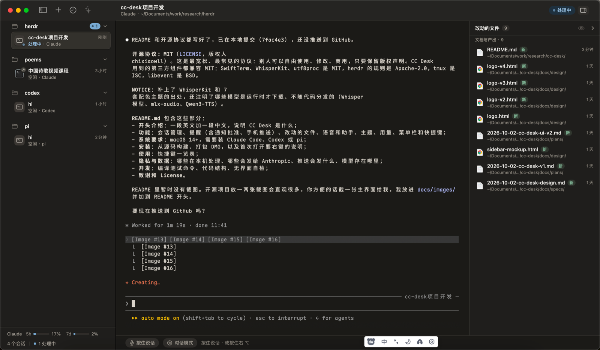
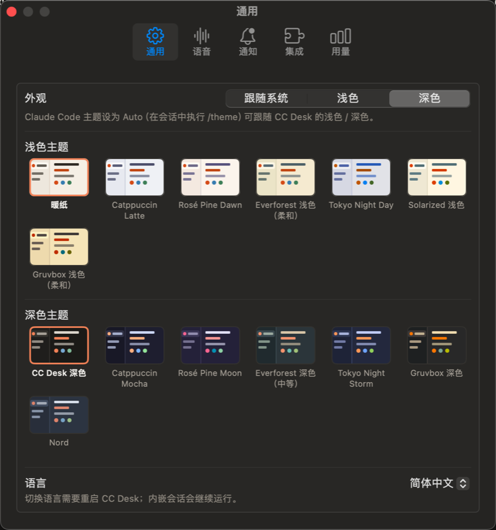
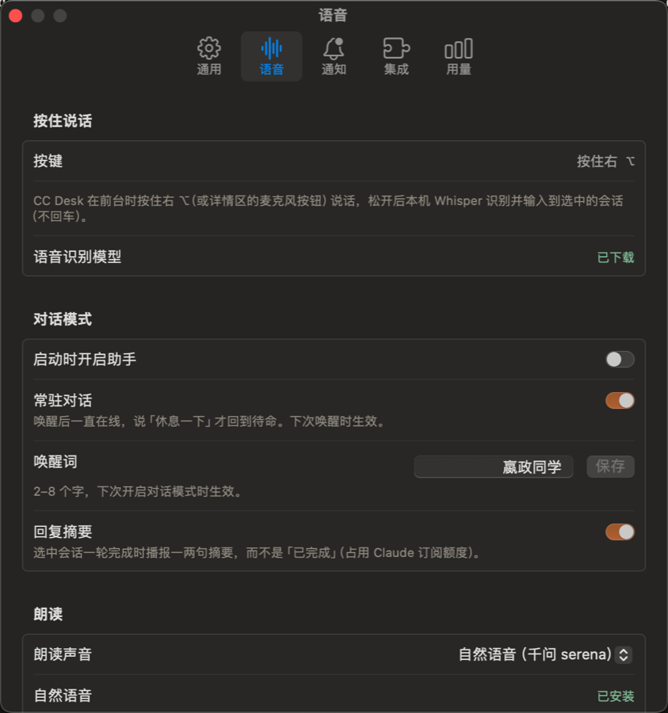

# CC Desk

**A macOS desk for your coding agents.** CC Desk lists every Claude Code, Codex and pi session on your Mac — grouped by project, with live status — and hosts them in embedded terminals that keep running even when the app quits. It notifies you when an agent needs approval or finishes, lets you approve from the notification (or your phone), and comes with a local voice assistant.

> 一个管理本机 coding agent 会话的 macOS 应用：左侧按项目列出所有 Claude Code / Codex / pi 会话和实时状态，右侧内嵌终端；会话由 tmux 托管，App 退出、重启也不中断。需要批准或任务完成时提醒你，可以直接在通知里批准，还带一个本地语音助手。



---

## 功能

**会话管理**
- 自动发现本机所有 Claude Code、Codex、pi 会话（包括在 Terminal、VS Code 里启动的），按项目目录分组；git worktree 单独成组并显示分支。
- 状态一目了然：处理中 / 等你批准 / 已完成未读 / 空闲 / 已结束。状态来自 agent 的 hook、会话记录和屏幕规则三路合并。
- 内嵌终端（SwiftTerm）托管在独立的 tmux 服务器里：**退出、重启、更新甚至崩溃都不会中断 agent**，重开后直接接回。
- 外部终端里的会话可以一键（或用语音）接管到 CC Desk。
- 侧栏固定顺序，可拖拽或右键调整；重启后选回上次的会话。
- 历史会话搜索与恢复（⇧⌘H）。
- 分屏：详情区最多同时显示 4 个会话（⌘D 向右、⇧⌘D 向下，或把侧栏会话拖到窗格的四边 / 中间），分隔线可拖动，按住窗格标题条拖到另一个窗格的四边 / 中间可挪动 / 互换，双击标题条或 ⇧⌘↩ 放大单个窗格；关闭分屏不结束会话，布局重启后恢复。
- 独立窗口：右键会话或窗格标题条「在新窗口中打开」，或把窗格标题条拖出窗格区域松手，会话移到自己的窗口里（拖出时窗口出现在松手处）（侧栏显示小窗口图标，点它把窗口拿到最前）；关闭窗口（或 ⌘W）放回主窗口，不结束会话；重启后窗口与位置一并恢复。

**提醒**
- 系统通知 + Dock 角标 + 菜单栏图标计数。
- **通知里直接「批准 / 拒绝」**：按下时会再核对会话仍在等同一个请求，避免批错。
- 推送到手机：Bark、ntfy 或自定义 Webhook（只在你离开电脑时推送，有频率限制）。

**看 agent 的产出**
- 「改动的文件」面板（⇧⌘F）：列出当前会话里 agent 新建或修改过的文件，文档类排在前面；空格快速查看，双击用默认 App 打开。
- 终端里 ⌘ 点文件路径直接快速查看。
- 技能库（⇧⌘K）：只读汇总本机 Claude Code（个人、claude.ai 同步、已安装插件、项目）、Codex、pi 的技能和 CC Desk 专业 agent，按来源分组，标出已停用的插件和能用它的 agent；可搜索、按 agent 过滤或只看当前会话能用的，查看 SKILL.md 内容、快速查看或用编辑器打开。

**语音**
- 按住右 ⌥ 说话：本地 Whisper（WhisperKit / CoreML）识别，只填入不发送。
- 对话模式（⌥⌘V，或全局 ⌃⌥V）：唤醒词唤起，说「发送」「取消」「批准」即可。
- 语音助手：常驻的 Claude（haiku）会话，通过 MCP 工具操作 CC Desk——切换、新建、恢复、关闭会话，往任意会话里打字，读屏回答「它卡在哪了」，把复杂问题交给 Sonnet / Opus 只读分析，或派一个新会话去干活。有副作用的操作会先口头确认。
- 可选本地自然语音（Qwen3-TTS，经 mlx-audio），不可用时自动退回系统声音。

**其他**
- 14 套配色主题（Catppuccin、Rosé Pine、Everforest、Tokyo Night、Solarized、Gruvbox、Nord 等），浅色 / 深色各选一套；Claude Code 设为 `/theme` → Auto 后会跟着切换。
- Claude 订阅用量显示（5 小时 / 7 天），会话完成时自动刷新。
- 菜单栏图标、登录时启动、全局快捷键（⌃⌥C 呼出窗口）。
- 中文 / English 界面。

## 截图

| 14 套配色主题 | 语音与对话模式设置 |
|---|---|
|  |  |

## 系统要求

- macOS 14 或更高，Apple 芯片或 Intel。
- 至少装了一个 agent：[Claude Code](https://docs.anthropic.com/en/docs/claude-code)、[Codex CLI](https://github.com/openai/codex) 或 [pi](https://github.com/earendil-works/pi)。
- 语音助手需要 Claude Code（使用你自己的 Claude 订阅）。

## 安装

### 从源码构建

需要 Xcode 16 / Swift 6.0 工具链。

```bash
git clone https://github.com/chixiaowll/cc-desk.git
cd cc-desk
./scripts/bundle.sh          # 生成 build/CCDesk.app
open build/CCDesk.app
```

本地构建使用 Homebrew 的 tmux（`brew install tmux`）；没有 tmux 时会退回普通终端，只是重启 App 会中断会话。

### 打包 DMG

```bash
./scripts/dmg.sh             # 生成 build/CCDesk-<version>.dmg（通用二进制，内置静态链接的 tmux）
```

DMG 未经苹果公证，首次打开请在「应用程序」里**右键 → 打开**。

## 使用

| 操作 | 快捷键 |
|---|---|
| 新建会话 | ⌘N |
| 切换会话 | ⌘1 … ⌘9 |
| 关闭会话 | ⌘W |
| 向右 / 向下分屏 | ⌘D / ⇧⌘D |
| 关闭分屏（会话继续运行） | ⌥⌘W |
| 放大 / 还原窗格 | ⇧⌘↩ |
| 在窗格间移动焦点 | ⌥⌘← / → / ↑ / ↓ |
| 历史会话 | ⇧⌘H |
| 改动的文件 | ⇧⌘F |
| 技能库 | ⇧⌘K |
| 助手结果 | ⇧⌘R |
| 对话模式 | ⌥⌘V（全局 ⌃⌥V） |
| 呼出 / 隐藏 CC Desk | ⌃⌥C（全局） |
| 显示主窗口 | ⌘0 |
| 设置 | ⌘, |

首次使用建议在「设置 → 集成」里安装 Claude / Codex / pi 的状态 hook，状态识别会更准确。

## 隐私与数据

- 语音识别完全在本机进行，录音不会离开电脑。
- 模型按需下载到 `~/Library/Application Support/CC Desk/`：Whisper 约 630MB（第一次用语音时），自然语音约 2.2GB（手动选择时）。
- 语音助手把识别出的文字、侧栏会话列表以及它读取的屏幕 / 会话记录片段，通过本机 `claude` 命令发送给 Anthropic，计入你的 Claude 订阅额度。
- 手机推送只发送项目名、会话标题和简短原因；推送密钥存放在 macOS 钥匙串。
- CC Desk 的状态文件在 `~/.cc-desk/`；控制接口是仅本用户可访问的 Unix socket，并要求每次启动生成的随机令牌。

## 开发

```bash
swift build
swift test                   # 纯逻辑都在 CCDeskCore，可脱离界面测试
./scripts/bundle.sh
```

- `Sources/CCDeskCore`：会话发现、状态合并、侧栏模型、tmux 托管规划、MCP / 控制协议、主题与配色等纯逻辑。
- `Sources/CCDesk`：SwiftUI + AppKit 界面、终端、语音、助手。
- 设计文档：`docs/specs/2026-10-02-cc-desk-design.md`。
- 无界面自检：`CCDesk --tmux-selftest`、`CCDesk --layout-selftest`、`CCDesk --skills-selftest`、`CCDesk --tts-test "你好"`、`CCDesk --consult-test`。

## 致谢

- [SwiftTerm](https://github.com/migueldeicaza/SwiftTerm)（MIT）—— 终端模拟
- [WhisperKit](https://github.com/argmaxinc/argmax-oss-swift)（MIT）—— 本地语音识别
- [herdr](https://github.com/herdrdev/herdr)（Apache-2.0）—— Codex / pi 屏幕状态规则
- [tmux](https://github.com/tmux/tmux)（ISC）—— 会话托管
- [mlx-audio](https://github.com/Blaizzy/mlx-audio)（MIT）与 Qwen3-TTS（Apache-2.0）—— 可选自然语音
- 配色来自 Catppuccin、Rosé Pine、Everforest、Tokyo Night、Solarized、Gruvbox、Nord

完整的第三方声明见 [NOTICE](NOTICE)。

## License

[MIT](LICENSE) © 2026 chixiaowll
